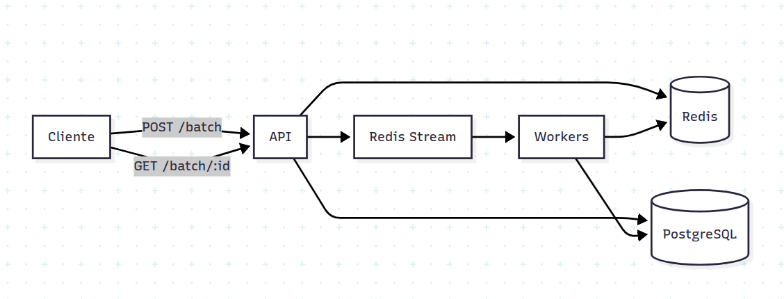
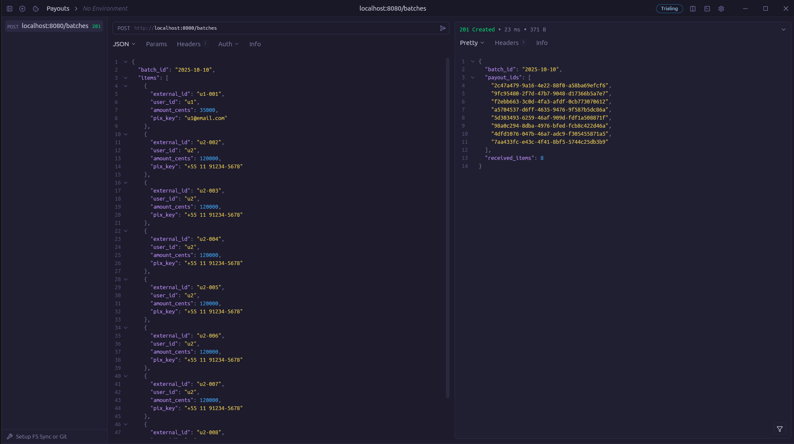
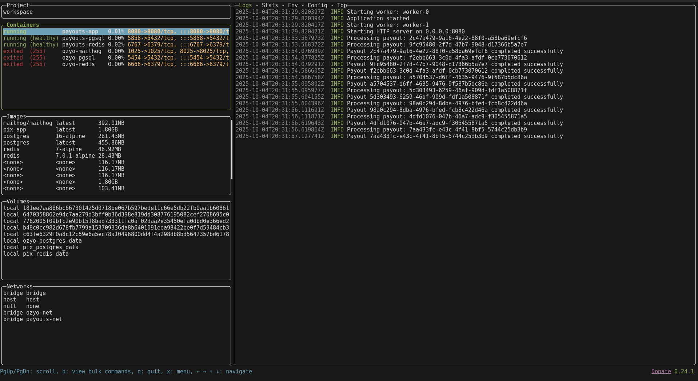

# Desafio Conty – {ErickJ3/@github}

> **Local da submissão:** `submissions/ErickJ3/pix`

---

## Requisitos

- **Docker**
- **Rust**

---

## Como rodar

```bash
# Copia o conteudo do .env.example para .env
cp env.example .env

# Inicia os containers
docker compose up --build -d
```

A aplicação estará disponível em `http://localhost:8080`

---

## Endpoints

### `POST /batches`
Envia um lote de pagamentos para processamento.

**Exemplo de requisição:**
```bash
curl -X POST http://localhost:8080/batches \
  -H "Content-Type: application/json" \
  -d @seeds/payouts_batch_example.json
```

**Corpo da requisição:**
```json
{
  "batch_id": "batch-123",
  "items": [
    {
      "external_id": "u1-001",
      "user_id": "u1",
      "amount_cents": 35000,
      "pix_key": "u1@email.com"
    }
  ]
}
```

**Resposta (201 Created):**
```json
{
  "batch_id": "batch-123",
  "payout_ids": [
    "2c47a479-9a16-4e22-88f0-a58ba69efcf6"
  ],
  "received_items": 8
}
```

---

### `GET /batches/:id`
Consulta o status de um lote de pagamentos.

**Exemplo de requisição:**
```bash
curl http://localhost:8080/batches/batch-123
```

**Resposta (200 OK):**
```json
{
  "batch_id": "batch-123",
  "payouts": [
    {
      "id": "7aa433fc-e43c-4f41-8bf5-5744c25db3b9",
      "batch_id": "2025-10-10",
      "external_id": "u2-008",
      "user_id": "u2",
      "amount_cents": 120000,
      "pix_key": "+55 11 91234-5678",
      "status": "Completed",
      "created_at": "2025-10-04T20:31:53.563189Z",
      "updated_at": "2025-10-04T20:31:57.124282Z",
      "idempotency_key": "2025-10-10:u2-008"
    }
  ],
  "summary": {
    "total": 1,
    "completed": 1,
    "failed": 0,
    "processing": 0,
    "pending": 0
  }
}
```

---

## Arquitetura

### Diagrama de componentes



### Camadas

- **API**: Exposição HTTP com Axum, recebe batches e consulta status
- **Repository**: Persistência no PostgreSQL com SQLx
- **PubSub**: Redis Streams para comunicação assíncrona entre API e workers
- **Workers**: Pool de processadores que consomem eventos da fila
- **Idempotency Service**: Controle de duplicação via Redis (locks + cache de resultados)

### Principais decisões técnicas

1. **Arquitetura baseada em filas (Redis Streams)**
   - **Motivo**: Evitar timeouts em processamento síncrono e permitir escalabilidade horizontal
   - **Trade-off**: Maior complexidade operacional vs. resiliência e throughput
   
2. **Idempotência em duas camadas**
   - **Banco de dados**: `UNIQUE` constraint em `idempotency_key` (formato: `{batch_id}:{external_id}`)
   - **Redis**: Lock distribuído para evitar processamento duplicado nos workers
   
3. **Consumer groups no Redis Streams**
   - Múltiplos workers podem processar eventos em paralelo
   - Garantia de entrega com ACK e reprocessamento de mensagens não confirmadas
   
4. **Aplicação single-binary com threads Tokio**
   - API e workers rodam no mesmo processo, compartilhando estado
   - Simplifica deployment mantendo isolamento lógico
      - **Trade-off**: Dificuldade para escalabilidade

### O que faria diferente com mais tempo

- **Dead Letter Queue (DLQ)**: Mover payouts com falhas repetidas para uma fila separada
- **Observabilidade**: Adicionar métricas (Prometheus) e tracing distribuído (OpenTelemetry)
- **Retry com backoff exponencial**: Melhorar resiliência em falhas transientes
- **Webhook de notificação**: Callback HTTP ao finalizar processamento do batch
- **Testes de carga**: Validar comportamento sob alta concorrência com k6/Gatling
- **Circuit breaker**: Proteger contra falhas em cascata no processamento

---

## Testes

### Como rodar

>  Para rodar os testes unitarios precisa ter o rust instalado: [Rust Install](https://rust-lang.org/learn/get-started/)

```bash
cargo test
```

### Cobertura

- **Idempotência**: Garantia de não duplicação por `external_id`
- **Persistência**: Inserção e consulta de batches no PostgreSQL
- **Workers**: Processamento de eventos da fila com ACK
- **API**: Validação de payloads e respostas HTTP

---

## Idempotência

A solução implementa idempotência em dois níveis:

1. **Nível de batch**: A chave `{batch_id}:{external_id}` garante que o mesmo payout não seja criado duas vezes no banco
2. **Nível de processamento**: Workers usam locks Redis para evitar processar o mesmo evento simultaneamente

**Exemplo de comportamento:**
```bash
# Primeira chamada: cria os payouts
curl -X POST http://localhost:8080/batches -d @batch.json
# Response: 201 Created

# Segunda chamada (mesmo batch_id/external_id): retorna os IDs existentes
curl -X POST http://localhost:8080/batches -d @batch.json
# Response: 200 OK (mesmos payout_ids)
```

### Screenshots

### Request-Response



### Logs docker


